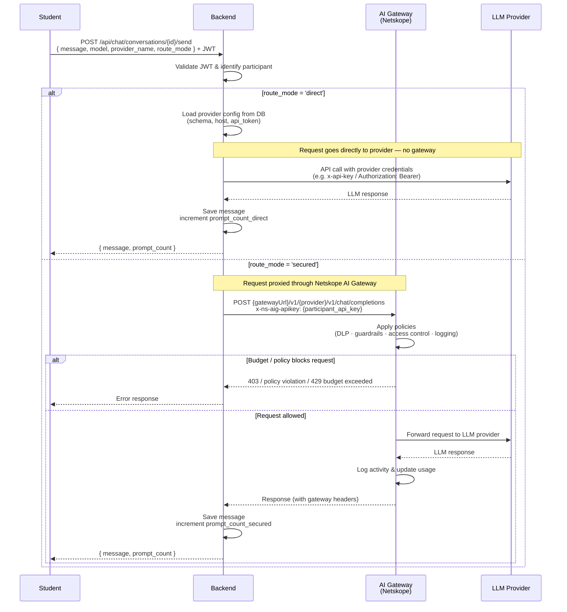

# LLM Request Flow — Direct vs Secured

## Comparación de flujos

| | Direct | Secured |
|---|---|---|
| **Ruta** | Student → Backend → LLM | Student → Backend → AI Gateway → LLM |
| **Auth al LLM** | API key del proveedor (en DB) | `x-ns-aig-apikey` del participante |
| **Políticas DLP** | ✗ No aplican | ✓ Evaluadas en el gateway |
| **Guardrails** | ✗ No aplican | ✓ Evaluados en el gateway |
| **Activity logging** | Solo en DB local | En gateway + DB local |
| **Counter** | `prompt_count_direct` | `prompt_count_secured` |
| **Credenciales expuestas** | API key real del proveedor | Token Netskope del participante |
